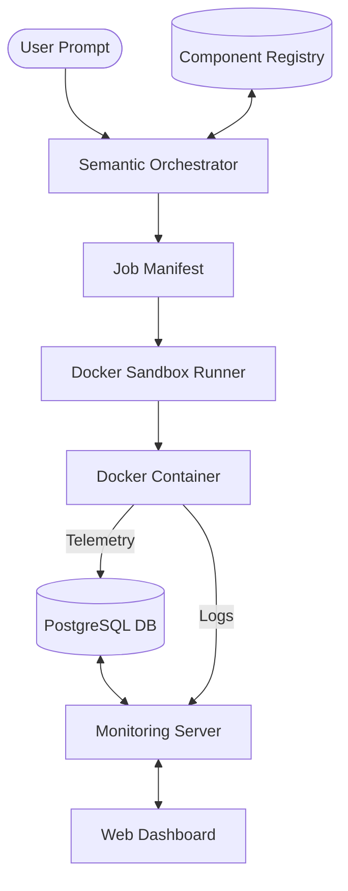

# Agno Fork: Semantic Orchestration & Observability

This fork of Agno introduces a high-level **Semantic Orchestration Layer** designed to bridge the gap between natural language requests and production-ready, observable agent execution.

## 🚀 Key Capabilities

While the base Agno framework provides the building blocks for agents, teams, and workflows, this fork adds a complete orchestration stack:

### 1. Semantic Component Registry
Automatically indexes your existing Agno Tools and Agents into a **ChromaDB** vector store. This allows the system to "understand" your toolbox and select the right components based on semantic similarity.

### 2. Natural Language Orchestrator
Translates plain English prompts into a structured `JobManifest`. 
- **Analysis**: Uses Gemini to determine the required tools and agent behaviors.
- **Search**: Queries the semantic registry to find the best-fit components.
- **Planning**: Generates a deterministic JSON plan for execution.

### 3. Isolated Docker Sandbox
Executes generated `JobManifests` in an isolated, secure container environment.
- **Isolation**: Code runs in a ephemeral `agno-sandbox` image.
- **Automatic Build**: Images are built dynamically with all required dependencies.
- **Secure Handling**: Environment variables (API keys) are securely injected into the sandbox.

### 4. PostgreSQL Observability Bridge
Transitioned from ephemeral logging to persistent, host-anchored telemetry.
- **Persistence**: All traces, spans, and sessions are stored in a local PostgreSQL instance.
- **Connectivity**: Uses `host.docker.internal` to route telemetry from the isolated sandbox back to the host.
- **Standardized**: Fully compatible with Agno's internal `tracing` and `db` modules.

### 5. Real-time Monitoring UI
A premium, glassmorphism-themed dashboard for monitoring and controlling the orchestrator.
- **Live Logs**: Real-time streaming of sandbox output.
- **Pipeline View**: Visual tracking of Planning -> Building -> Execution.
- **Trace Explorer**: Dive deep into the history of every orchestration run.

---

## 🏗️ Architecture



---

## 🛠️ Getting Started

### Prerequisites
- **Docker**: For the execution sandbox.
- **PostgreSQL**: For the observability bridge (recommend using the provided script).
- **Python 3.12+**: Recommend using the Agno `demo` environment.

### Setup
1. **Clone and Install Dependencies**:
   ```bash
   ./scripts/demo_setup.sh
   source .venvs/demo/bin/activate
   ```
2. **Start Infrastructure**:
   ```bash
   # Starts PostgreSQL for telemetry on port 5532
   ./scripts/run_observability_db.sh
   ```
3. **Configure Environment**:
   Create a `.env` file with your `GOOGLE_API_KEY` and any other required provider keys.

### Running the Orchestrator
You can run the full end-to-end flow via the terminal or the dashboard.

**Terminal Demo**:
```bash
.venvs/demo/bin/python cookbook/93_components/registry_orchestrator/end_to_end_demo.py
```

**Web Dashboard (Recommended)**:
```bash
.venvs/demo/bin/python scripts/monitor_server.py
```
Then navigate to `http://localhost:8142` in your browser.

---

## 📂 Project Structure Extensions

- `libs/agno/agno/orchestrator/`: Core logic for manifest generation.
- `libs/agno/agno/sandbox/`: Docker runner and container management.
- `registry/`: Default location for tools and agents.
- `scripts/monitor_server.py`: FastAPI server for the UI.
- `scripts/static/`: Dashboard assets.
- `scripts/run_observability_db.sh`: Postgres provisioning.
